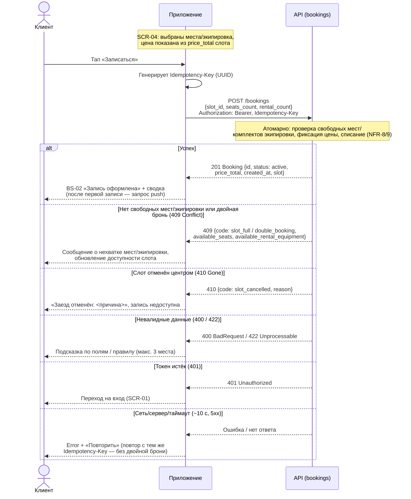

# Sequence-диаграмма API-взаимодействия

> Этап 3. Проектирование. Как клиент и сервер обмениваются вызовами в критичных сценариях
> бронирования. Контракты API — в многофайловой спецификации
> [api/redocly.yaml](../api/redocly.yaml) (домены `bookings`, `slots`, `auth`).
> Операции: `createBooking`.

> **Сквозные правила взаимодействия.**
> - Все вызовы — с `Authorization: Bearer <token>` (`bearerAuth`); при истёкшем/неверном токене
>   сервер отвечает `401`, клиент уходит на вход [SCR-01](../3-design-brief/scr-01-registration.md).
> - Сервер — **источник истины** по времени и доступности: `slot.start_at` в UTC, тип отмены и
>   наличие мест/экипировки проверяет сервер, клиент их не пересчитывает (R-005, R-021).
> - Запись/отмена **атомарны**: овербукинг и двойная бронь исключены (NFR-8, NFR-9).
> - Таймаут запроса ~10 с; мутации офлайн запрещены — см. единый паттерн Error/Retry (R-020).

## Сценарий 1: Создание брони (`createBooking`, UC-1)

Поток: [SCR-04 «Оформление брони»](../3-design-brief/scr-04-booking.md) → `POST /bookings`
→ [BS-02 «Успешное бронирование»](../3-design-brief/bs-02-booking-success.md). Клиент отправляет
`slot_id`, `seats_count` (1..3) и `rental_count` (0..seats_count). Итоговую цену `price_total`
(RUB, read-only) считает сервер — клиент её не вычисляет, а показывает (R-005, R-010).

