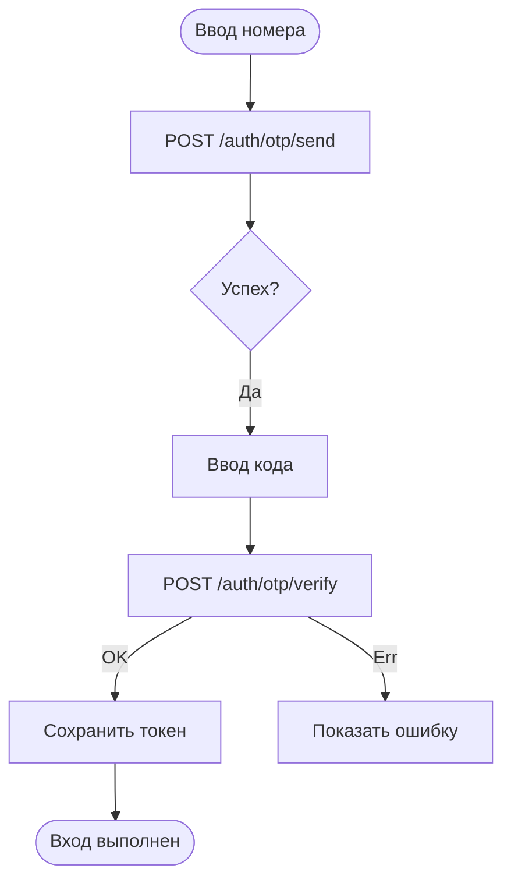

# OTP авторизация

**ID:** LOGIC-01  
**Тип:** Логика  
**Домен:** 09. Логики  
**Приоритет:** Critical  
**Статус:** Актуален  
**Функциональные блоки:** FB-AUTH-001

---

## История изменений

| Релиз | ТЗ | Описание изменений |
|-------|-----|-------------------|
| — | — | Первоначальная документация |

---

## Входные данные

| Название | Тип | Возможные значения | Описание |
|----------|-----|-------------------|----------|
| `phone` | Ввод пользователя | "+7XXXXXXXXXX" | Номер телефона пользователя |
| `deviceuuid` | Устройство | UUID | Идентификатор устройства для регистрации push/безопасности |

---

## Обзор

Логика отправки одноразового кода (OTP) на телефон и его верификации. Используется для входа и подтверждения номера.

### User Story

> Как пользователь, я хочу получить код на телефон и ввести его, чтобы безопасно войти в приложение.

### Бизнес-ценность

- Снижает барьер входа (без пароля)
- Соответствует требованиям безопасности

---

## Точки применения

| Экран/Компонент | Элемент/Триггер | Условие |
|-----------------|-----------------|---------|
| [Auth Screen] | Кнопка "Получить код" | Номер валиден |
| [Auth Screen] | Авто-подстановка кода | При наличии SMS-permission |

---

## Флоу

---

## Описание логики

1. Валидировать формат номера на клиенте.
2. При тапе отправлять запрос отправки OTP.
3. Показывать индикатор загрузки и таймер повторной отправки (e.g., 60s).
4. При вводе кода вызывать верификацию; при успехе получить accessToken и refreshToken.
5. Сохранить токены в защищённом хранилище и пометить пользователя как авторизованного.

---

## API запросы

### POST /auth/otp/send

**Триггер:** Тап "Получить код"  
**Headers:** deviceuuid  
**Body:** { "phone": "+7..." }

**Обработка ответа:**

| Результат | Действие |
|-----------|----------|
| 200 | Показать экран ввода кода, запустить таймер |
| 400 | Показать ошибку (некорректный формат) |
| 429 | Показать "Слишком часто" |
| Ошибка сети | Снек "Нет соединения" |

### POST /auth/otp/verify

**Body:** { "phone": "+7...", "code": "1234" }

**Обработка ответа:**

| Результат | Действие |
|-----------|----------|
| 200 | Сохранить tokens, навигация домой |
| 401 | Показать "Неверный код" |
| 410 | Показать "Код просрочен" |

---

## Локальное хранение

| Ключ | Тип хранения | Описание |
|------|--------------|----------|
| `auth_token` | Защищённое хранилище | access token |
| `refresh_token` | Защищённое хранилище | refresh token |
| `user_phone` | Локальный кэш | Номер телефона |

---

## Связанные требования

| ID | Название | Приоритет |
|----|----------|-----------|
| REQ-FUNC-AUTH-01 | OTP вход | Critical |

---

## Критерии приёмки

| ID | Критерий |
|----|---------|
| AC-001 | **Дано** валидный номер, **Когда** пользователь запрашивает код, **Тогда** приходит SMS и показывается экран ввода |
| AC-002 | **Дано** правильный код, **Когда** пользователь вводит код, **Тогда** он получает токен и входит |

---

## Обработка ошибок

| Тип ошибки | Контекст | Действие |
|------------|----------|----------|
| Слишком частые запросы | /auth/otp/send | Показывать таймер повторной отправки |
| Неверный код | /auth/otp/verify | Показать локальный снек с подсказкой |
