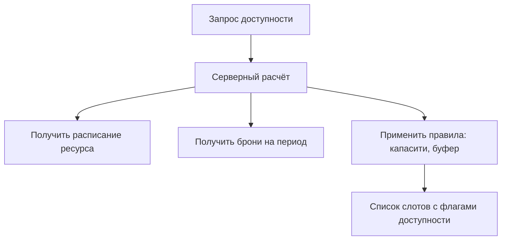

# Расчёт доступности слотов

**ID:** LOGIC-02  
**Тип:** Логика  
**Домен:** 09. Логики  
**Приоритет:** High  
**Статус:** Актуален  
**Функциональные блоки:** FB-SLOTS-001

---

## Обзор

Логика рассчитывает доступные слоты для ресурса на выбранную дату/период с учётом расписания, существующих бронирований, capacity и правил буфера.

### User Story

> Как пользователь, я хочу видеть только доступные слоты, чтобы забронировать услугу в подходящее время.

---

## Флоу

---

## Правила расчёта

- Учитывать рабочие часы ресурса (time zone).
- Исключать интервалы, где суммарная нагрузка >= capacity.
- Учитывать буферы до/после (min_gap_before, min_gap_after).
- Учитывать минимальную и максимальную длительность слота.
- При конкурирующих запросах использовать атомарные проверки на сервере (transaction/row lock).

---

## API запросы

### GET /resources/{id}/availability?from=&to=&duration=

**Параметры:** resourceId, from (ISO), to (ISO), duration (мин)

**Обработка ответа:**

| Результат | Действие |
|-----------|----------|
| 200 | Отобразить слоты; пометить disabled/available |
| 400 | Показать ошибку ввода |
| 5xx | Показать общую ошибку и retry |

---

## Критерии приёмки

| ID | Критерий |
|----|---------|
| AC-001 | Запрос возвращает слоты в рабочие часы с учётом бронирований |
| AC-002 | Слоты у которых суммарная нагрузка превышает capacity помечены недоступными |

---

## Обработка ошибок

| Тип ошибки | Контекст | Действие |
|------------|----------|----------|
| Несовпадение таймзон | Клиент/сервер | Приводить всё к UTC на сервере и пересчитывать |