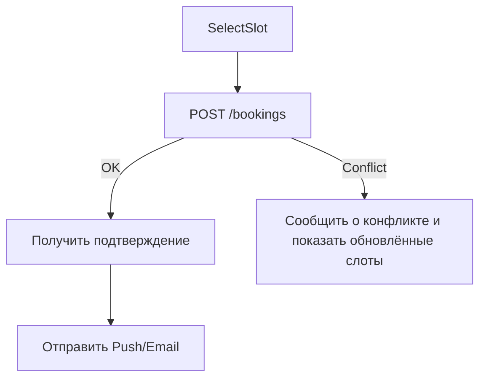

# Создание брони

**ID:** LOGIC-03  
**Тип:** Логика  
**Домен:** 09. Логики  
**Приоритет:** Critical  
**Статус:** Актуален  
**Функциональные блоки:** FB-BOOK-001

---

## Обзор

Логика создания брони: выбор слота, валидация, резервирование, подтверждение, уведомление.

### User Story

> Как пользователь, я хочу забронировать свободный слот и получить подтверждение, чтобы быть увереным в своём времени.

---

## Флоу

---

## Ключевые моменты

- Использовать idempotency-key при создании брони (клиент генерирует UUID).
- На сервере: в транзакции проверить доступность слота (повторная проверка), уменьшить доступную capacity и сохранить бронь.
- В ответе возвращать status: confirmed / pending / conflict и TTL резерва, если есть временная блокировка.
- Если требуется оплата, вернуть redirect/payment intent и отложить подтверждение до успешной оплаты.

---

## API запросы

### POST /bookings

**Body:** { "resource_id": "..", "slot_start": ISO, "duration_min": n, "user_id": "..", "idempotency_key": "uuid" }

**Обработка ответа:**

| Код | Описание |
|-----|----------|
| 201 | Бронирование создано: вернуть booking_id, status, details |
| 409 | Конфликт: слот уже занят — вернуть свежий список слотов |
| 422 | Неверные данные |

---

## Локальное хранение

| Ключ | Тип хранения | Описание |
|------|--------------|----------|
| `pending_booking:{key}` | Локальный кэш | Хранить draft брони до подтверждения |

---

## Критерии приёмки

| ID | Критерий |
|----|---------|
| AC-001 | При корректных данных возвращается 201 и booking_id |
| AC-002 | Повторный запрос с тем же idempotency_key не создаёт дубликат |

---

## Обработка ошибок

| Тип ошибки | Контекст | Действие |
|------------|----------|----------|
| Конфликт брони | При создании | Показать конфликт и обновлённые слоты |
| Ошибка сети | Во время создания | Показать возможность повторной отправки (retry) |