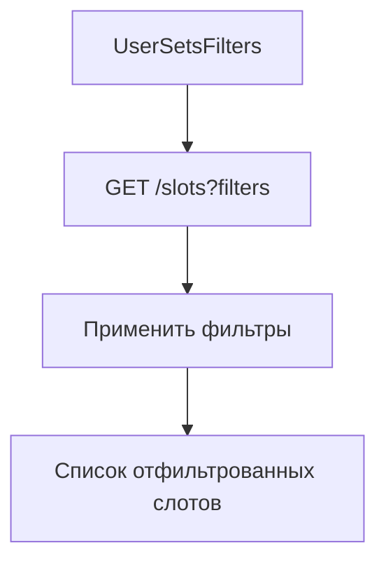

# Фильтрация слотов

**ID:** LOGIC-05  
**Тип:** Логика  
**Домен:** 09. Логики  
**Приоритет:** Medium  
**Статус:** Актуален  
**Функциональные блоки:** FB-SLOTS-002

---

## Обзор

Клиентская и серверная фильтрация слотов: по времени, длительности, типу ресурса, цене и доступности.

### User Story

> Как пользователь, я хочу фильтровать слоты, чтобы быстро найти подходящее время.

---

## Флоу

---

## Подход

- Предпочтительно выполнять фильтрацию на сервере для корректного учёта доступности.
- Клиент кеширует последний ответ и применяет легкие client-side фильтры (например: сортировка, поиск по названию).
- Фильтры передавать как query-параметры: date_from, date_to, duration_min, resource_type, price_min/max, only_available=true.

---

## API запросы

### GET /slots?date_from=&date_to=&duration=&resource_type=&only_available=

**Обработка ответа:**

| Код | Действие |
|-----|----------|
| 200 | Отобразить результаты и сохранить текущее состояние фильтров |
| 400 | Неверные параметры |

---

## Критерии приёмки

| ID | Критерий |
|----|---------|
| AC-001 | Фильтры возвращают корректный подмножество слотов по заданным параметрам |
| AC-002 | only_available=true исключает занятые слоты |

---

## Обработка ошибок

| Тип ошибки | Контекст | Действие |
|------------|----------|----------|
| Большой ответ | При широких фильтрах | Пагинация, lazy-load |